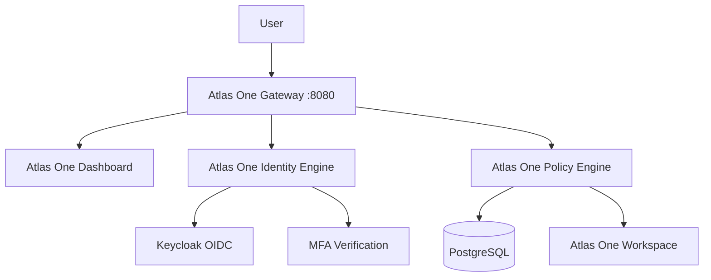

# ATLAS ONE

Atlas One is a Zero Trust Secure Access Platform that protects web applications through centralized identity, MFA, policy enforcement, and gateway-based access control without modifying protected application code.

For the MVP, Atlas One secures one demo application:

- Atlas One Workspace (internally backed by Dashy)

The user-facing entrypoint is only:

- `http://localhost:8080`

No other internal service ports are exposed publicly.

## Overview

Traditional model:

User -> Application Login -> Application

Atlas One model:

User -> Atlas One Gateway -> Identity Engine -> MFA -> Policy Engine -> Protected Application

## Architecture Diagram



## Features

- Atlas One Gateway reverse-proxy and access chokepoint
- Atlas One Login with username, password, and OTP
- JWT access and refresh token flows
- MFA modes: required, optional, disabled
- RBAC policy engine with Admin, Developer, Guest roles
- Central policy enforcement before protected app routing
- Branded Atlas One dashboard and workspace experience
- Persistent PostgreSQL data volume
- Docker Compose one-command startup
- CI/CD workflows for quality and security controls

## Tech Stack

- Backend: Python, FastAPI
- Frontend: React, TypeScript, Vite
- Identity: Keycloak, OAuth2, OpenID Connect, MFA support
- Gateway: NGINX reverse proxy
- Database: PostgreSQL
- Protected application: Dashy (internal only)
- Platform: Docker Compose
- CI/CD: GitHub Actions

## Project Structure

```text
atlas-one/
	gateway/
		nginx.conf
	routing/
	auth/
	keycloak/
		realm/
	themes/
	realm/
	policy-engine/
		app/
			rbac/
			jwt/
	dashboard/
		src/
			components/
			pages/
	database/
		postgres/
	apps/
		dashy/
	.github/
		workflows/
	docs/
		architecture/
		screenshots/
	docker-compose.yml
```

## Installation

1. Clone repository.
2. Copy environment template:

	 `cp .env.example .env`

3. Start platform:

	 `docker compose up -d --build`

4. Open Atlas One:

	 `http://localhost:8080`

## Docker Setup

The stack includes:

- Atlas One Gateway (public)
- Atlas One Dashboard (internal)
- Atlas One Policy Engine (internal)
- Atlas One Identity Engine (internal)
- PostgreSQL (internal)
- Atlas One Workspace app (internal)

Compose includes:

- Persistent volume for PostgreSQL
- Health checks per service
- Restart policy `unless-stopped`
- Shared internal bridge network

## Authentication Flow

1. User opens `localhost:8080`.
2. Atlas One Login prompts for username, password, OTP.
3. Atlas One Identity + Policy layer validates credentials and MFA.
4. JWT access and refresh tokens are issued in secure cookies.
5. Access request to `/workspace` is checked by gateway subrequest.
6. Policy engine validates user state, MFA, role.
7. Access is granted and workspace is proxied.

## Policy Engine

Roles:

- Admin -> workspace
- Developer -> workspace
- Guest -> workspace

Checks performed before authorization:

- User active status
- MFA verification requirement
- Role-based resource permission

Policy behavior is configurable through environment variables and policy modules.

## Atlas One Workspace

- Workspace is available externally at `http://localhost:8080/workspace`.
- Internal backing service runs as Dashy at `http://dashy:4000`.
- User-facing branding is Atlas One Workspace.

## Screenshots

Place product screenshots in:

- `docs/screenshots/`

Recommended captures:

- Atlas One Login
- Atlas One Dashboard
- Atlas One Workspace

## CI/CD

Configured GitHub Actions:

- Backend: Ruff, Pytest, build verification
- Frontend: npm install, ESLint, TypeScript check, build
- Docker: compose validation and image builds
- Security: Bandit, Safety, Trivy, secret scanning
- Release: changelog generation and GitHub Releases

Pull requests run CI checks so maintainers can enforce branch protection and prevent merging on failure.

## Roadmap

- Full OIDC browser SSO redirect integration
- Dynamic app onboarding registry
- Admin UI for policy management
- Device posture checks
- Audit logs and SIEM export
- Multi-tenant support

## Repository Initialization Checklist

This repository includes:

- `.gitignore`
- `README.md`
- `LICENSE`
- `SECURITY.md`
- `CONTRIBUTING.md`
- `CODE_OF_CONDUCT.md`
- Issue templates
- Pull request template
- GitHub workflow automation

GitHub Discussions should be enabled in repository settings.

